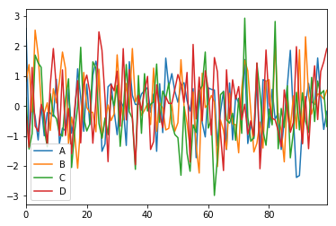

```python
import pandas as pd
import numpy as np
%matplotlib inline
```


```python
from plotly import __version__
```


```python
print(__version__)
```

    2.0.7


```python
import cufflinks as cf
```


```python
from plotly.offline import download_plotlyjs,init_notebook_mode,plot,iplot
```


```python
init_notebook_mode(connected=True)
```


<script>requirejs.config({paths: { 'plotly': ['https://cdn.plot.ly/plotly-latest.min']},});if(!window.Plotly) {{require(['plotly'],function(plotly) {window.Plotly=plotly;});}}</script>


```python
cf.go_offline()
```

    IOPub data rate exceeded.
    The notebook server will temporarily stop sending output
    to the client in order to avoid crashing it.
    To change this limit, set the config variable
    `--NotebookApp.iopub_data_rate_limit`.


```python
# DATA
df = pd.DataFrame(np.random.randn(100,4),columns='A B C D'.split())
```


```python
df.head()
```


<div>
<table border="1" class="dataframe">
  <thead>
    <tr style="text-align: right;">
      <th></th>
      <th>A</th>
      <th>B</th>
      <th>C</th>
      <th>D</th>
    </tr>
  </thead>
  <tbody>
    <tr>
      <th>0</th>
      <td>2.586670</td>
      <td>0.822039</td>
      <td>0.269696</td>
      <td>-0.176235</td>
    </tr>
    <tr>
      <th>1</th>
      <td>-0.999010</td>
      <td>1.381023</td>
      <td>-1.434998</td>
      <td>-1.375667</td>
    </tr>
    <tr>
      <th>2</th>
      <td>0.087146</td>
      <td>-0.199869</td>
      <td>-0.929716</td>
      <td>1.285647</td>
    </tr>
    <tr>
      <th>3</th>
      <td>-0.342893</td>
      <td>2.529917</td>
      <td>1.697786</td>
      <td>-0.669984</td>
    </tr>
    <tr>
      <th>4</th>
      <td>-1.133675</td>
      <td>1.716704</td>
      <td>1.436601</td>
      <td>-0.849154</td>
    </tr>
  </tbody>
</table>
</div>


```python
df2 = pd.DataFrame({'Category':['A','B','C'], 'Values':[32,43,50]})
```


```python
df2
```


<div>
<table border="1" class="dataframe">
  <thead>
    <tr style="text-align: right;">
      <th></th>
      <th>Category</th>
      <th>Values</th>
    </tr>
  </thead>
  <tbody>
    <tr>
      <th>0</th>
      <td>A</td>
      <td>32</td>
    </tr>
    <tr>
      <th>1</th>
      <td>B</td>
      <td>43</td>
    </tr>
    <tr>
      <th>2</th>
      <td>C</td>
      <td>50</td>
    </tr>
  </tbody>
</table>
</div>


```python
df.plot()
```


    <matplotlib.axes._subplots.AxesSubplot at 0x7ff636f145c0>





```python
df.iplot()
```


<div id="f862bd10-ab63-4e18-87ce-9790bde147b9" style="height: 525px; width: 100%;" class="plotly-graph-div"></div><script type="text/javascript">require(["plotly"], function(Plotly) { window.PLOTLYENV=window.PLOTLYENV || {};window.PLOTLYENV.BASE_URL="https://plot.ly";Plotly.newPlot("f862bd10-ab63-4e18-87ce-9790bde147b9", [{"type": "scatter", "x": [0, 1, 2, 3, 4, 5, 6, 7, 8, 9, 10, 11, 12, 13, 14, 15, 16, 17, 18, 19, 20, 21, 22, 23, 24, 25, 26, 27, 28, 29, 30, 31, 32, 33, 34, 35, 36, 37, 38, 39, 40, 41, 42, 43, 44, 45, 46, 47, 48, 49, 50, 51, 52, 53, 54, 55, 56, 57, 58, 59, 60, 61, 62, 63, 64, 65, 66, 67, 68, 69, 70, 71, 72, 73, 74, 75, 76, 77, 78, 79, 80, 81, 82, 83, 84, 85, 86, 87, 88, 89, 90, 91, 92, 93, 94, 95, 96, 97, 98, 99], "y": [2.5866700268054377, -0.999010063637169, 0.08714565944255066, -0.3428934580584113, -1.1336747897148427, 0.03111032289758169, -0.9943790468044289, -0.22065946602790554, -0.23437425673761703, -0.3469981603646329, 0.8920664284500706, -1.24514491190826, -0.7386128089498888, -0.8290885335984041, 0.5728217726762569, -0.9095862344670148, -0.3517701089405946, 1.2387772801425034, 0.2893886781846748, -0.8438147281622062, 0.7266441245548908, -0.6192609844841197, 1.0252081239628734, 1.4950388881119345, 1.0515489559843547, -1.5125996593715716, -1.265149881941422, 0.6405023468044967, 0.742509745401191, -0.16050484287955052, -0.957200083512988, 0.19164375973353065, -0.018234833169462807, -1.3167287525767948, 1.4784198739834844, 0.3559368925497911, 0.05126325091332131, 0.050844493754911894, 0.3995356251589455, 0.5152478358449666, 0.6109888995086488, -0.20745196128793067, 0.3989684511954174, -1.512041096364818, 0.7427411244616996, -0.8891099694135737, 1.596936660348011, 0.6455011220912307, 1.079217988518591, 0.4831812669020866, 0.12408314508280092, 0.6759241472867028, 0.7779342392711832, 0.1761734320765802, -0.17114083460304513, 0.5806639019416259, -1.7265476388100134, 0.44240729212190477, -0.5592961299410046, -1.0331666772098558, 0.6041548344345529, 0.5552997925303936, 0.5344978972280106, -1.328891871762493, -0.20953958036096226, 0.49297520063048833, -1.4527692611152143, 0.7697988245505013, -1.1302216411717776, 0.3278662511496663, 0.09898059988654856, -0.06349472352238429, 1.547388203000196, -1.252128265078349, -0.6061128810998003, -1.0909858096368934, 0.8472490491609276, -1.5532563605043046, 0.8789398339630787, 0.8269175360166855, -0.722135860907175, 0.5568526260455536, -0.4374628074035477, -0.24218760440650264, -1.4519324316115998, -0.5117075262849675, 0.6719008905379702, 1.8576865725099647, -0.3620244773236545, -2.3841021126283835, -2.3192508684087008, -0.614150725244445, 0.06407704290823271, 0.7522680959333481, 0.1397704820219409, 0.055867640332324775, 1.6011244250611794, 0.2711169455926217, -0.7824464758273767, -0.1800938367876853], "name": "A", "text": "", "line": {"color": "rgba(255, 153, 51, 1.0)", "width": 1.3, "dash": "solid"}, "mode": "lines"}, {"type": "scatter", "x": [0, 1, 2, 3, 4, 5, 6, 7, 8, 9, 10, 11, 12, 13, 14, 15, 16, 17, 18, 19, 20, 21, 22, 23, 24, 25, 26, 27, 28, 29, 30, 31, 32, 33, 34, 35, 36, 37, 38, 39, 40, 41, 42, 43, 44, 45, 46, 47, 48, 49, 50, 51, 52, 53, 54, 55, 56, 57, 58, 59, 60, 61, 62, 63, 64, 65, 66, 67, 68, 69, 70, 71, 72, 73, 74, 75, 76, 77, 78, 79, 80, 81, 82, 83, 84, 85, 86, 87, 88, 89, 90, 91, 92, 93, 94, 95, 96, 97, 98, 99], "y": [0.8220393360588825, 1.3810233266870267, -0.1998688766483461, 2.529917410869557, 1.716703555530959, 0.06795034971017663, -0.2429853169316711, 0.10615753535607621, -0.8167539663975136, 0.5777797014208842, 0.10169567508214153, 0.8266193086655043, 1.7991052082805867, 1.2461811207536284, -1.2620472099942677, -0.37257917261780726, -0.945861195819606, -2.075578207713548, -0.5851916859250028, 1.1190171505177604, -0.04886837123795679, -0.22179183573872416, -0.21022113247336138, -0.8627990658063895, 1.2276857458353791, -1.0707186703181766, -0.47862754379684663, 0.035804194662917156, -0.48907886771797987, -0.26357816951489876, 1.7064553359544534, 0.27073965282503737, -0.46682042886199765, 0.7502678847760633, -0.09141030700435682, 1.9160668297294257, 0.14019294884784017, 0.40470440006401476, -0.31371484777408826, -0.14058999687589613, 0.08074971130589392, -0.6199352690321202, 1.2630357059420323, -0.8464387637917679, 0.09686905184027819, -0.07469349363141921, -0.8007920291340932, -0.7464775340180817, 0.054444828129056315, -0.8394978938644218, -0.5584457808158633, 1.5431342042627818, 0.02089862106993958, -0.574520182574558, -1.382837402930908, 0.4676390699499025, -1.3375090052815501, -2.2355372702713994, 1.0938357757689003, -0.053488670257900994, 0.07061792477842821, 0.35052083286914687, 0.13578746975095457, -2.0239511814161335, -0.4685278523681607, -0.8167766200753441, -1.4469063367685675, 0.4232950209718085, -0.5999490079420419, -0.6224491280307776, -1.5607718998731497, 0.5863670849336934, 1.5230784434950402, 1.1729507702452053, -0.2038801677257477, -1.5338980021833852, -1.243903141693782, -0.5385850073074909, -1.4020258545493804, 0.8259068371743707, 0.8786223207706709, -0.5910864439183544, 2.162952018965763, -0.41415715288699917, -0.803529495477475, -1.863542018381492, 0.3477248225233606, -0.7568625231300523, 0.3356498659385539, -0.7555317440503657, 1.8748758761597393, -1.231423381215157, 2.3080455411899696, 0.35260063389175356, -0.270115410188141, 0.1109853594274923, 0.4007989600047342, 0.36762078979312046, 0.23258886636547715, 0.5225980924165161], "name": "B", "text": "", "line": {"color": "rgba(55, 128, 191, 1.0)", "width": 1.3, "dash": "solid"}, "mode": "lines"}, {"type": "scatter", "x": [0, 1, 2, 3, 4, 5, 6, 7, 8, 9, 10, 11, 12, 13, 14, 15, 16, 17, 18, 19, 20, 21, 22, 23, 24, 25, 26, 27, 28, 29, 30, 31, 32, 33, 34, 35, 36, 37, 38, 39, 40, 41, 42, 43, 44, 45, 46, 47, 48, 49, 50, 51, 52, 53, 54, 55, 56, 57, 58, 59, 60, 61, 62, 63, 64, 65, 66, 67, 68, 69, 70, 71, 72, 73, 74, 75, 76, 77, 78, 79, 80, 81, 82, 83, 84, 85, 86, 87, 88, 89, 90, 91, 92, 93, 94, 95, 96, 97, 98, 99], "y": [0.26969620461780647, -1.4349984426049283, -0.9297162166812002, 1.697785708860584, 1.436601046733749, 1.288627177048318, -0.7663227437028326, -1.361839363373588, 0.40787780830839054, -0.2858138107668894, -0.4221563995353901, -0.9150557482511256, -1.0073068004363652, 0.22506321496001133, 0.9067001842166895, -2.052086673042269, -0.8601542147757687, -0.022784362218626054, 1.9582754519991237, -0.40170204320060404, -0.834819081486368, -0.5992112059208259, 1.4742203357025563, 1.2646581579478746, -0.5826203280579059, -1.0795549719472417, -0.40626345622957283, -0.9576736234278134, 0.36829592847358333, 0.015207938133230056, 0.6847293652907691, -1.3461107806748027, -0.1861633253002699, 1.3833414207552366, -0.19128084813977464, -0.41512491229199927, -2.1137153806635705, 1.0141909975295726, -0.9121770317464004, 1.078586325267491, -0.16951485933563656, 0.05536829298834225, 0.13871519978145233, 1.399292035959782, -0.5458035463625514, 0.4995806345390134, 0.25437020507280045, 0.7642458233146581, -0.5996441631128961, -0.9550692362706809, -1.0568091820889514, -2.3115564367917694, -0.021283217600382882, -1.5744859728237381, -2.177680136355049, -0.6282504415366279, -0.8870644162781317, 0.5108854073308307, 0.6780415483855561, 1.7996579643915054, -0.7394676263690858, -0.44349449700985266, -2.9836804615396435, -1.7342234386506437, 0.3779302245214147, 0.47748343066467674, -0.4668603908564858, -0.5745166996985819, -0.2449935182657516, -1.1456017549746136, 0.2593998231089786, -0.9134734274467544, 2.9291246347191566, -0.3723790925816392, -1.1786104713062855, -1.0458162562182691, 1.4206610418282672, 0.4513807898686239, -0.8314056386216009, -1.310543101474995, -0.10268674774846563, -0.6314341430530345, 2.819649297774308, -1.4256900876006768, -0.08275371258300876, -0.7139924518319004, 0.6722292701608488, -1.7294490746377889, -0.8680125799038797, 0.4544558641872888, -0.7984552798312834, 0.4413131400837328, -0.5004798785883656, -0.8844452745127778, 0.9534278635339277, -0.5196400545537719, 0.8348309826085664, 0.39537904202558627, 0.5155154187442065, -0.6834114735807428], "name": "C", "text": "", "line": {"color": "rgba(50, 171, 96, 1.0)", "width": 1.3, "dash": "solid"}, "mode": "lines"}, {"type": "scatter", "x": [0, 1, 2, 3, 4, 5, 6, 7, 8, 9, 10, 11, 12, 13, 14, 15, 16, 17, 18, 19, 20, 21, 22, 23, 24, 25, 26, 27, 28, 29, 30, 31, 32, 33, 34, 35, 36, 37, 38, 39, 40, 41, 42, 43, 44, 45, 46, 47, 48, 49, 50, 51, 52, 53, 54, 55, 56, 57, 58, 59, 60, 61, 62, 63, 64, 65, 66, 67, 68, 69, 70, 71, 72, 73, 74, 75, 76, 77, 78, 79, 80, 81, 82, 83, 84, 85, 86, 87, 88, 89, 90, 91, 92, 93, 94, 95, 96, 97, 98, 99], "y": [-0.17623456310313731, -1.3756672620280963, 1.2856466160121194, -0.669983585064461, -0.8491540727290757, 0.056212425012536295, -0.2728562985796661, -1.294748016194132, 0.725497654029619, 1.9159737287156893, 0.5957929724483192, -0.9867505053000696, 1.2041197113296345, -0.9864640693698189, -0.0832142136428224, -1.5896897041479585, -0.09826072477649088, 0.8451464182647499, -1.2321908064401659, 0.705162883849787, 1.0291657932230889, 0.4651406817100582, -1.2423771261059309, 0.1584158647770487, 2.4727784665446184, 1.8593855722353327, 0.28084216065495177, -1.8570811967344625, 0.7227302435671389, 0.5078485702385024, 1.162818911780481, -0.6766348245986552, 1.9131040003946043, -0.46602465035683815, 1.2149646678695354, -0.365169159488467, -1.9583958836592321, 0.351236671821175, -0.14688636440671338, 0.5008328635003703, 0.9873670368977872, -1.4516187269705052, -1.188673346682586, 0.7066423247975353, -0.23953686444663294, -0.7222599766090962, 0.312027844111461, 0.08405446588848943, 0.08601637106760444, 0.5631491050002425, 1.0483783659523265, 0.7302400525657589, 0.11904633116240829, 1.1184302028391335, -1.8676343445335053, 2.0529861655112, -0.4311063739374164, 0.9616633313313572, -0.4968335826473929, 1.174497185949587, 0.5505739308359835, -0.9713558418218512, 1.6139769607327572, 1.1429511794989207, -0.8852328196223326, -2.153590199148775, 1.2067572770260084, -0.422551851778284, 0.8742191121917223, 0.230681613172842, 0.6477598971986844, -0.4636094453920211, 0.05857460950125001, -0.9424594614445048, -0.4917653914449607, -0.9861455632803244, 1.4389180381936115, -2.093426008954321, -0.45878916228150757, 1.8670641323807178, 0.1132533488359526, -0.4059478525684893, -0.4661152237012827, -0.8239206521308827, -1.3580208346162315, 0.5377429112763359, -0.17424781003360265, -0.8788538811602418, -0.5495896215021941, 1.9786281279570144, -0.062253583901841485, -1.2621712525999207, 0.31475399309982777, -1.4248388015910463, 0.24706200628983158, 1.340253549638352, -0.4529318859183745, 1.1512316426955502, 1.4684361467935307, 1.9116398718498624], "name": "D", "text": "", "line": {"color": "rgba(128, 0, 128, 1.0)", "width": 1.3, "dash": "solid"}, "mode": "lines"}], {"legend": {"bgcolor": "#F5F6F9", "font": {"color": "#4D5663"}}, "paper_bgcolor": "#F5F6F9", "plot_bgcolor": "#F5F6F9", "yaxis1": {"tickfont": {"color": "#4D5663"}, "gridcolor": "#E1E5ED", "titlefont": {"color": "#4D5663"}, "zerolinecolor": "#E1E5ED", "showgrid": true, "title": ""}, "xaxis1": {"tickfont": {"color": "#4D5663"}, "gridcolor": "#E1E5ED", "titlefont": {"color": "#4D5663"}, "zerolinecolor": "#E1E5ED", "showgrid": true, "title": ""}, "titlefont": {"color": "#4D5663"}}, {"showLink": true, "linkText": "Export to plot.ly"})});</script>


```python
df.iplot(kind='scatter',x='A',y='B', mode='markers')
```


<div id="f280c664-9408-4e8e-8de6-6880e1d6ed31" style="height: 525px; width: 100%;" class="plotly-graph-div"></div><script type="text/javascript">require(["plotly"], function(Plotly) { window.PLOTLYENV=window.PLOTLYENV || {};window.PLOTLYENV.BASE_URL="https://plot.ly";Plotly.newPlot("f280c664-9408-4e8e-8de6-6880e1d6ed31", [{"type": "scatter", "x": [2.5866700268054377, -0.999010063637169, 0.08714565944255066, -0.3428934580584113, -1.1336747897148427, 0.03111032289758169, -0.9943790468044289, -0.22065946602790554, -0.23437425673761703, -0.3469981603646329, 0.8920664284500706, -1.24514491190826, -0.7386128089498888, -0.8290885335984041, 0.5728217726762569, -0.9095862344670148, -0.3517701089405946, 1.2387772801425034, 0.2893886781846748, -0.8438147281622062, 0.7266441245548908, -0.6192609844841197, 1.0252081239628734, 1.4950388881119345, 1.0515489559843547, -1.5125996593715716, -1.265149881941422, 0.6405023468044967, 0.742509745401191, -0.16050484287955052, -0.957200083512988, 0.19164375973353065, -0.018234833169462807, -1.3167287525767948, 1.4784198739834844, 0.3559368925497911, 0.05126325091332131, 0.050844493754911894, 0.3995356251589455, 0.5152478358449666, 0.6109888995086488, -0.20745196128793067, 0.3989684511954174, -1.512041096364818, 0.7427411244616996, -0.8891099694135737, 1.596936660348011, 0.6455011220912307, 1.079217988518591, 0.4831812669020866, 0.12408314508280092, 0.6759241472867028, 0.7779342392711832, 0.1761734320765802, -0.17114083460304513, 0.5806639019416259, -1.7265476388100134, 0.44240729212190477, -0.5592961299410046, -1.0331666772098558, 0.6041548344345529, 0.5552997925303936, 0.5344978972280106, -1.328891871762493, -0.20953958036096226, 0.49297520063048833, -1.4527692611152143, 0.7697988245505013, -1.1302216411717776, 0.3278662511496663, 0.09898059988654856, -0.06349472352238429, 1.547388203000196, -1.252128265078349, -0.6061128810998003, -1.0909858096368934, 0.8472490491609276, -1.5532563605043046, 0.8789398339630787, 0.8269175360166855, -0.722135860907175, 0.5568526260455536, -0.4374628074035477, -0.24218760440650264, -1.4519324316115998, -0.5117075262849675, 0.6719008905379702, 1.8576865725099647, -0.3620244773236545, -2.3841021126283835, -2.3192508684087008, -0.614150725244445, 0.06407704290823271, 0.7522680959333481, 0.1397704820219409, 0.055867640332324775, 1.6011244250611794, 0.2711169455926217, -0.7824464758273767, -0.1800938367876853], "y": [0.8220393360588825, 1.3810233266870267, -0.1998688766483461, 2.529917410869557, 1.716703555530959, 0.06795034971017663, -0.2429853169316711, 0.10615753535607621, -0.8167539663975136, 0.5777797014208842, 0.10169567508214153, 0.8266193086655043, 1.7991052082805867, 1.2461811207536284, -1.2620472099942677, -0.37257917261780726, -0.945861195819606, -2.075578207713548, -0.5851916859250028, 1.1190171505177604, -0.04886837123795679, -0.22179183573872416, -0.21022113247336138, -0.8627990658063895, 1.2276857458353791, -1.0707186703181766, -0.47862754379684663, 0.035804194662917156, -0.48907886771797987, -0.26357816951489876, 1.7064553359544534, 0.27073965282503737, -0.46682042886199765, 0.7502678847760633, -0.09141030700435682, 1.9160668297294257, 0.14019294884784017, 0.40470440006401476, -0.31371484777408826, -0.14058999687589613, 0.08074971130589392, -0.6199352690321202, 1.2630357059420323, -0.8464387637917679, 0.09686905184027819, -0.07469349363141921, -0.8007920291340932, -0.7464775340180817, 0.054444828129056315, -0.8394978938644218, -0.5584457808158633, 1.5431342042627818, 0.02089862106993958, -0.574520182574558, -1.382837402930908, 0.4676390699499025, -1.3375090052815501, -2.2355372702713994, 1.0938357757689003, -0.053488670257900994, 0.07061792477842821, 0.35052083286914687, 0.13578746975095457, -2.0239511814161335, -0.4685278523681607, -0.8167766200753441, -1.4469063367685675, 0.4232950209718085, -0.5999490079420419, -0.6224491280307776, -1.5607718998731497, 0.5863670849336934, 1.5230784434950402, 1.1729507702452053, -0.2038801677257477, -1.5338980021833852, -1.243903141693782, -0.5385850073074909, -1.4020258545493804, 0.8259068371743707, 0.8786223207706709, -0.5910864439183544, 2.162952018965763, -0.41415715288699917, -0.803529495477475, -1.863542018381492, 0.3477248225233606, -0.7568625231300523, 0.3356498659385539, -0.7555317440503657, 1.8748758761597393, -1.231423381215157, 2.3080455411899696, 0.35260063389175356, -0.270115410188141, 0.1109853594274923, 0.4007989600047342, 0.36762078979312046, 0.23258886636547715, 0.5225980924165161], "name": "B", "text": "", "line": {"color": "rgba(255, 153, 51, 1.0)", "width": 1.3, "dash": "solid"}, "mode": "markers", "marker": {"symbol": "dot", "size": 12}}], {"legend": {"bgcolor": "#F5F6F9", "font": {"color": "#4D5663"}}, "paper_bgcolor": "#F5F6F9", "plot_bgcolor": "#F5F6F9", "yaxis1": {"tickfont": {"color": "#4D5663"}, "gridcolor": "#E1E5ED", "titlefont": {"color": "#4D5663"}, "zerolinecolor": "#E1E5ED", "showgrid": true, "title": ""}, "xaxis1": {"tickfont": {"color": "#4D5663"}, "gridcolor": "#E1E5ED", "titlefont": {"color": "#4D5663"}, "zerolinecolor": "#E1E5ED", "showgrid": true, "title": ""}, "titlefont": {"color": "#4D5663"}}, {"showLink": true, "linkText": "Export to plot.ly"})});</script>


```python
df2.iplot(kind='bar', x='Category', y='Values')
```


<div id="fea2f1cf-c066-4a3a-b046-ebb1db53566a" style="height: 525px; width: 100%;" class="plotly-graph-div"></div><script type="text/javascript">require(["plotly"], function(Plotly) { window.PLOTLYENV=window.PLOTLYENV || {};window.PLOTLYENV.BASE_URL="https://plot.ly";Plotly.newPlot("fea2f1cf-c066-4a3a-b046-ebb1db53566a", [{"type": "bar", "x": ["A", "B", "C"], "y": [32, 43, 50], "name": "Values", "text": "", "marker": {"color": "rgba(255, 153, 51, 0.6)", "line": {"color": "rgba(255, 153, 51, 1.0)", "width": 1}}, "orientation": "v"}], {"legend": {"bgcolor": "#F5F6F9", "font": {"color": "#4D5663"}}, "paper_bgcolor": "#F5F6F9", "plot_bgcolor": "#F5F6F9", "yaxis1": {"tickfont": {"color": "#4D5663"}, "gridcolor": "#E1E5ED", "titlefont": {"color": "#4D5663"}, "zerolinecolor": "#E1E5ED", "showgrid": true, "title": ""}, "xaxis1": {"tickfont": {"color": "#4D5663"}, "gridcolor": "#E1E5ED", "titlefont": {"color": "#4D5663"}, "zerolinecolor": "#E1E5ED", "showgrid": true, "title": ""}, "titlefont": {"color": "#4D5663"}}, {"showLink": true, "linkText": "Export to plot.ly"})});</script>


```python
df.iplot(kind='box')
```


<div id="17a498ea-f16d-4190-8f32-040552c86ad4" style="height: 525px; width: 100%;" class="plotly-graph-div"></div><script type="text/javascript">require(["plotly"], function(Plotly) { window.PLOTLYENV=window.PLOTLYENV || {};window.PLOTLYENV.BASE_URL="https://plot.ly";Plotly.newPlot("17a498ea-f16d-4190-8f32-040552c86ad4", [{"type": "box", "y": [2.5866700268054377, -0.999010063637169, 0.08714565944255066, -0.3428934580584113, -1.1336747897148427, 0.03111032289758169, -0.9943790468044289, -0.22065946602790554, -0.23437425673761703, -0.3469981603646329, 0.8920664284500706, -1.24514491190826, -0.7386128089498888, -0.8290885335984041, 0.5728217726762569, -0.9095862344670148, -0.3517701089405946, 1.2387772801425034, 0.2893886781846748, -0.8438147281622062, 0.7266441245548908, -0.6192609844841197, 1.0252081239628734, 1.4950388881119345, 1.0515489559843547, -1.5125996593715716, -1.265149881941422, 0.6405023468044967, 0.742509745401191, -0.16050484287955052, -0.957200083512988, 0.19164375973353065, -0.018234833169462807, -1.3167287525767948, 1.4784198739834844, 0.3559368925497911, 0.05126325091332131, 0.050844493754911894, 0.3995356251589455, 0.5152478358449666, 0.6109888995086488, -0.20745196128793067, 0.3989684511954174, -1.512041096364818, 0.7427411244616996, -0.8891099694135737, 1.596936660348011, 0.6455011220912307, 1.079217988518591, 0.4831812669020866, 0.12408314508280092, 0.6759241472867028, 0.7779342392711832, 0.1761734320765802, -0.17114083460304513, 0.5806639019416259, -1.7265476388100134, 0.44240729212190477, -0.5592961299410046, -1.0331666772098558, 0.6041548344345529, 0.5552997925303936, 0.5344978972280106, -1.328891871762493, -0.20953958036096226, 0.49297520063048833, -1.4527692611152143, 0.7697988245505013, -1.1302216411717776, 0.3278662511496663, 0.09898059988654856, -0.06349472352238429, 1.547388203000196, -1.252128265078349, -0.6061128810998003, -1.0909858096368934, 0.8472490491609276, -1.5532563605043046, 0.8789398339630787, 0.8269175360166855, -0.722135860907175, 0.5568526260455536, -0.4374628074035477, -0.24218760440650264, -1.4519324316115998, -0.5117075262849675, 0.6719008905379702, 1.8576865725099647, -0.3620244773236545, -2.3841021126283835, -2.3192508684087008, -0.614150725244445, 0.06407704290823271, 0.7522680959333481, 0.1397704820219409, 0.055867640332324775, 1.6011244250611794, 0.2711169455926217, -0.7824464758273767, -0.1800938367876853], "marker": {"color": "rgba(255, 153, 51, 1.0)"}, "name": "A", "line": {"width": 1.3}, "boxpoints": false}, {"type": "box", "y": [0.8220393360588825, 1.3810233266870267, -0.1998688766483461, 2.529917410869557, 1.716703555530959, 0.06795034971017663, -0.2429853169316711, 0.10615753535607621, -0.8167539663975136, 0.5777797014208842, 0.10169567508214153, 0.8266193086655043, 1.7991052082805867, 1.2461811207536284, -1.2620472099942677, -0.37257917261780726, -0.945861195819606, -2.075578207713548, -0.5851916859250028, 1.1190171505177604, -0.04886837123795679, -0.22179183573872416, -0.21022113247336138, -0.8627990658063895, 1.2276857458353791, -1.0707186703181766, -0.47862754379684663, 0.035804194662917156, -0.48907886771797987, -0.26357816951489876, 1.7064553359544534, 0.27073965282503737, -0.46682042886199765, 0.7502678847760633, -0.09141030700435682, 1.9160668297294257, 0.14019294884784017, 0.40470440006401476, -0.31371484777408826, -0.14058999687589613, 0.08074971130589392, -0.6199352690321202, 1.2630357059420323, -0.8464387637917679, 0.09686905184027819, -0.07469349363141921, -0.8007920291340932, -0.7464775340180817, 0.054444828129056315, -0.8394978938644218, -0.5584457808158633, 1.5431342042627818, 0.02089862106993958, -0.574520182574558, -1.382837402930908, 0.4676390699499025, -1.3375090052815501, -2.2355372702713994, 1.0938357757689003, -0.053488670257900994, 0.07061792477842821, 0.35052083286914687, 0.13578746975095457, -2.0239511814161335, -0.4685278523681607, -0.8167766200753441, -1.4469063367685675, 0.4232950209718085, -0.5999490079420419, -0.6224491280307776, -1.5607718998731497, 0.5863670849336934, 1.5230784434950402, 1.1729507702452053, -0.2038801677257477, -1.5338980021833852, -1.243903141693782, -0.5385850073074909, -1.4020258545493804, 0.8259068371743707, 0.8786223207706709, -0.5910864439183544, 2.162952018965763, -0.41415715288699917, -0.803529495477475, -1.863542018381492, 0.3477248225233606, -0.7568625231300523, 0.3356498659385539, -0.7555317440503657, 1.8748758761597393, -1.231423381215157, 2.3080455411899696, 0.35260063389175356, -0.270115410188141, 0.1109853594274923, 0.4007989600047342, 0.36762078979312046, 0.23258886636547715, 0.5225980924165161], "marker": {"color": "rgba(55, 128, 191, 1.0)"}, "name": "B", "line": {"width": 1.3}, "boxpoints": false}, {"type": "box", "y": [0.26969620461780647, -1.4349984426049283, -0.9297162166812002, 1.697785708860584, 1.436601046733749, 1.288627177048318, -0.7663227437028326, -1.361839363373588, 0.40787780830839054, -0.2858138107668894, -0.4221563995353901, -0.9150557482511256, -1.0073068004363652, 0.22506321496001133, 0.9067001842166895, -2.052086673042269, -0.8601542147757687, -0.022784362218626054, 1.9582754519991237, -0.40170204320060404, -0.834819081486368, -0.5992112059208259, 1.4742203357025563, 1.2646581579478746, -0.5826203280579059, -1.0795549719472417, -0.40626345622957283, -0.9576736234278134, 0.36829592847358333, 0.015207938133230056, 0.6847293652907691, -1.3461107806748027, -0.1861633253002699, 1.3833414207552366, -0.19128084813977464, -0.41512491229199927, -2.1137153806635705, 1.0141909975295726, -0.9121770317464004, 1.078586325267491, -0.16951485933563656, 0.05536829298834225, 0.13871519978145233, 1.399292035959782, -0.5458035463625514, 0.4995806345390134, 0.25437020507280045, 0.7642458233146581, -0.5996441631128961, -0.9550692362706809, -1.0568091820889514, -2.3115564367917694, -0.021283217600382882, -1.5744859728237381, -2.177680136355049, -0.6282504415366279, -0.8870644162781317, 0.5108854073308307, 0.6780415483855561, 1.7996579643915054, -0.7394676263690858, -0.44349449700985266, -2.9836804615396435, -1.7342234386506437, 0.3779302245214147, 0.47748343066467674, -0.4668603908564858, -0.5745166996985819, -0.2449935182657516, -1.1456017549746136, 0.2593998231089786, -0.9134734274467544, 2.9291246347191566, -0.3723790925816392, -1.1786104713062855, -1.0458162562182691, 1.4206610418282672, 0.4513807898686239, -0.8314056386216009, -1.310543101474995, -0.10268674774846563, -0.6314341430530345, 2.819649297774308, -1.4256900876006768, -0.08275371258300876, -0.7139924518319004, 0.6722292701608488, -1.7294490746377889, -0.8680125799038797, 0.4544558641872888, -0.7984552798312834, 0.4413131400837328, -0.5004798785883656, -0.8844452745127778, 0.9534278635339277, -0.5196400545537719, 0.8348309826085664, 0.39537904202558627, 0.5155154187442065, -0.6834114735807428], "marker": {"color": "rgba(50, 171, 96, 1.0)"}, "name": "C", "line": {"width": 1.3}, "boxpoints": false}, {"type": "box", "y": [-0.17623456310313731, -1.3756672620280963, 1.2856466160121194, -0.669983585064461, -0.8491540727290757, 0.056212425012536295, -0.2728562985796661, -1.294748016194132, 0.725497654029619, 1.9159737287156893, 0.5957929724483192, -0.9867505053000696, 1.2041197113296345, -0.9864640693698189, -0.0832142136428224, -1.5896897041479585, -0.09826072477649088, 0.8451464182647499, -1.2321908064401659, 0.705162883849787, 1.0291657932230889, 0.4651406817100582, -1.2423771261059309, 0.1584158647770487, 2.4727784665446184, 1.8593855722353327, 0.28084216065495177, -1.8570811967344625, 0.7227302435671389, 0.5078485702385024, 1.162818911780481, -0.6766348245986552, 1.9131040003946043, -0.46602465035683815, 1.2149646678695354, -0.365169159488467, -1.9583958836592321, 0.351236671821175, -0.14688636440671338, 0.5008328635003703, 0.9873670368977872, -1.4516187269705052, -1.188673346682586, 0.7066423247975353, -0.23953686444663294, -0.7222599766090962, 0.312027844111461, 0.08405446588848943, 0.08601637106760444, 0.5631491050002425, 1.0483783659523265, 0.7302400525657589, 0.11904633116240829, 1.1184302028391335, -1.8676343445335053, 2.0529861655112, -0.4311063739374164, 0.9616633313313572, -0.4968335826473929, 1.174497185949587, 0.5505739308359835, -0.9713558418218512, 1.6139769607327572, 1.1429511794989207, -0.8852328196223326, -2.153590199148775, 1.2067572770260084, -0.422551851778284, 0.8742191121917223, 0.230681613172842, 0.6477598971986844, -0.4636094453920211, 0.05857460950125001, -0.9424594614445048, -0.4917653914449607, -0.9861455632803244, 1.4389180381936115, -2.093426008954321, -0.45878916228150757, 1.8670641323807178, 0.1132533488359526, -0.4059478525684893, -0.4661152237012827, -0.8239206521308827, -1.3580208346162315, 0.5377429112763359, -0.17424781003360265, -0.8788538811602418, -0.5495896215021941, 1.9786281279570144, -0.062253583901841485, -1.2621712525999207, 0.31475399309982777, -1.4248388015910463, 0.24706200628983158, 1.340253549638352, -0.4529318859183745, 1.1512316426955502, 1.4684361467935307, 1.9116398718498624], "marker": {"color": "rgba(128, 0, 128, 1.0)"}, "name": "D", "line": {"width": 1.3}, "boxpoints": false}], {"legend": {"bgcolor": "#F5F6F9", "font": {"color": "#4D5663"}}, "paper_bgcolor": "#F5F6F9", "plot_bgcolor": "#F5F6F9", "yaxis1": {"tickfont": {"color": "#4D5663"}, "gridcolor": "#E1E5ED", "titlefont": {"color": "#4D5663"}, "zerolinecolor": "#E1E5ED", "showgrid": true, "title": ""}, "xaxis1": {"tickfont": {"color": "#4D5663"}, "gridcolor": "#E1E5ED", "titlefont": {"color": "#4D5663"}, "zerolinecolor": "#E1E5ED", "showgrid": true, "title": ""}, "titlefont": {"color": "#4D5663"}}, {"showLink": true, "linkText": "Export to plot.ly"})});</script>


```python
df3 = pd.DataFrame({'x':[1,2,3,4,5],'y':[10,20,30,20,10],'z':[500,400,300,200,100]})
```


```python
df3.iplot(kind='surface')
```


<div id="576d674a-81d2-47c9-ac14-6362e739395b" style="height: 525px; width: 100%;" class="plotly-graph-div"></div><script type="text/javascript">require(["plotly"], function(Plotly) { window.PLOTLYENV=window.PLOTLYENV || {};window.PLOTLYENV.BASE_URL="https://plot.ly";Plotly.newPlot("576d674a-81d2-47c9-ac14-6362e739395b", [{"type": "surface", "z": [[1, 2, 3, 4, 5], [10, 20, 30, 20, 10], [500, 400, 300, 200, 100]], "x": [0, 1, 2, 3, 4], "y": ["x", "y", "z"], "colorscale": [[0.0, "rgb(255, 153, 51)"], [0.1111111111111111, "rgb(55, 128, 191)"], [0.2222222222222222, "rgb(50, 171, 96)"], [0.3333333333333333, "rgb(128, 0, 128)"], [0.4444444444444444, "rgb(219, 64, 82)"], [0.5555555555555556, "rgb(0, 128, 128)"], [0.6666666666666666, "rgb(255, 255, 51)"], [0.7777777777777778, "rgb(128, 128, 0)"], [0.8888888888888888, "rgb(251, 128, 114)"], [1.0, "rgb(128, 177, 211)"]]}], {"legend": {"bgcolor": "#F5F6F9", "font": {"color": "#4D5663"}}, "paper_bgcolor": "#F5F6F9", "plot_bgcolor": "#F5F6F9", "yaxis1": {"tickfont": {"color": "#4D5663"}, "gridcolor": "#E1E5ED", "titlefont": {"color": "#4D5663"}, "zerolinecolor": "#E1E5ED", "showgrid": true, "title": ""}, "xaxis1": {"tickfont": {"color": "#4D5663"}, "gridcolor": "#E1E5ED", "titlefont": {"color": "#4D5663"}, "zerolinecolor": "#E1E5ED", "showgrid": true, "title": ""}, "titlefont": {"color": "#4D5663"}}, {"showLink": true, "linkText": "Export to plot.ly"})});</script>


```python
df['A'].iplot(kind='hist',bins=50)
```


<div id="1069bf49-a87b-440f-a9a1-0ad4583b113b" style="height: 525px; width: 100%;" class="plotly-graph-div"></div><script type="text/javascript">require(["plotly"], function(Plotly) { window.PLOTLYENV=window.PLOTLYENV || {};window.PLOTLYENV.BASE_URL="https://plot.ly";Plotly.newPlot("1069bf49-a87b-440f-a9a1-0ad4583b113b", [{"type": "histogram", "x": [2.5866700268054377, -0.999010063637169, 0.08714565944255066, -0.3428934580584113, -1.1336747897148427, 0.03111032289758169, -0.9943790468044289, -0.22065946602790554, -0.23437425673761703, -0.3469981603646329, 0.8920664284500706, -1.24514491190826, -0.7386128089498888, -0.8290885335984041, 0.5728217726762569, -0.9095862344670148, -0.3517701089405946, 1.2387772801425034, 0.2893886781846748, -0.8438147281622062, 0.7266441245548908, -0.6192609844841197, 1.0252081239628734, 1.4950388881119345, 1.0515489559843547, -1.5125996593715716, -1.265149881941422, 0.6405023468044967, 0.742509745401191, -0.16050484287955052, -0.957200083512988, 0.19164375973353065, -0.018234833169462807, -1.3167287525767948, 1.4784198739834844, 0.3559368925497911, 0.05126325091332131, 0.050844493754911894, 0.3995356251589455, 0.5152478358449666, 0.6109888995086488, -0.20745196128793067, 0.3989684511954174, -1.512041096364818, 0.7427411244616996, -0.8891099694135737, 1.596936660348011, 0.6455011220912307, 1.079217988518591, 0.4831812669020866, 0.12408314508280092, 0.6759241472867028, 0.7779342392711832, 0.1761734320765802, -0.17114083460304513, 0.5806639019416259, -1.7265476388100134, 0.44240729212190477, -0.5592961299410046, -1.0331666772098558, 0.6041548344345529, 0.5552997925303936, 0.5344978972280106, -1.328891871762493, -0.20953958036096226, 0.49297520063048833, -1.4527692611152143, 0.7697988245505013, -1.1302216411717776, 0.3278662511496663, 0.09898059988654856, -0.06349472352238429, 1.547388203000196, -1.252128265078349, -0.6061128810998003, -1.0909858096368934, 0.8472490491609276, -1.5532563605043046, 0.8789398339630787, 0.8269175360166855, -0.722135860907175, 0.5568526260455536, -0.4374628074035477, -0.24218760440650264, -1.4519324316115998, -0.5117075262849675, 0.6719008905379702, 1.8576865725099647, -0.3620244773236545, -2.3841021126283835, -2.3192508684087008, -0.614150725244445, 0.06407704290823271, 0.7522680959333481, 0.1397704820219409, 0.055867640332324775, 1.6011244250611794, 0.2711169455926217, -0.7824464758273767, -0.1800938367876853], "name": "A", "marker": {"color": "rgba(255, 153, 51, 1.0)", "line": {"width": 1.3, "color": "#4D5663"}}, "orientation": "v", "opacity": 0.8, "histfunc": "count", "histnorm": "", "nbinsx": 50}], {"legend": {"bgcolor": "#F5F6F9", "font": {"color": "#4D5663"}}, "paper_bgcolor": "#F5F6F9", "plot_bgcolor": "#F5F6F9", "yaxis1": {"tickfont": {"color": "#4D5663"}, "gridcolor": "#E1E5ED", "titlefont": {"color": "#4D5663"}, "zerolinecolor": "#E1E5ED", "showgrid": true, "title": ""}, "xaxis1": {"tickfont": {"color": "#4D5663"}, "gridcolor": "#E1E5ED", "titlefont": {"color": "#4D5663"}, "zerolinecolor": "#E1E5ED", "showgrid": true, "title": ""}, "titlefont": {"color": "#4D5663"}, "barmode": "overlay"}, {"showLink": true, "linkText": "Export to plot.ly"})});</script>


```python
df[['A','B']].iplot(kind='spread')
```


<div id="9535ce23-e13f-48dc-89b6-a7595dfd4106" style="height: 525px; width: 100%;" class="plotly-graph-div"></div><script type="text/javascript">require(["plotly"], function(Plotly) { window.PLOTLYENV=window.PLOTLYENV || {};window.PLOTLYENV.BASE_URL="https://plot.ly";Plotly.newPlot("9535ce23-e13f-48dc-89b6-a7595dfd4106", [{"type": "scatter", "x": [0, 1, 2, 3, 4, 5, 6, 7, 8, 9, 10, 11, 12, 13, 14, 15, 16, 17, 18, 19, 20, 21, 22, 23, 24, 25, 26, 27, 28, 29, 30, 31, 32, 33, 34, 35, 36, 37, 38, 39, 40, 41, 42, 43, 44, 45, 46, 47, 48, 49, 50, 51, 52, 53, 54, 55, 56, 57, 58, 59, 60, 61, 62, 63, 64, 65, 66, 67, 68, 69, 70, 71, 72, 73, 74, 75, 76, 77, 78, 79, 80, 81, 82, 83, 84, 85, 86, 87, 88, 89, 90, 91, 92, 93, 94, 95, 96, 97, 98, 99], "y": [2.5866700268054377, -0.999010063637169, 0.08714565944255066, -0.3428934580584113, -1.1336747897148427, 0.03111032289758169, -0.9943790468044289, -0.22065946602790554, -0.23437425673761703, -0.3469981603646329, 0.8920664284500706, -1.24514491190826, -0.7386128089498888, -0.8290885335984041, 0.5728217726762569, -0.9095862344670148, -0.3517701089405946, 1.2387772801425034, 0.2893886781846748, -0.8438147281622062, 0.7266441245548908, -0.6192609844841197, 1.0252081239628734, 1.4950388881119345, 1.0515489559843547, -1.5125996593715716, -1.265149881941422, 0.6405023468044967, 0.742509745401191, -0.16050484287955052, -0.957200083512988, 0.19164375973353065, -0.018234833169462807, -1.3167287525767948, 1.4784198739834844, 0.3559368925497911, 0.05126325091332131, 0.050844493754911894, 0.3995356251589455, 0.5152478358449666, 0.6109888995086488, -0.20745196128793067, 0.3989684511954174, -1.512041096364818, 0.7427411244616996, -0.8891099694135737, 1.596936660348011, 0.6455011220912307, 1.079217988518591, 0.4831812669020866, 0.12408314508280092, 0.6759241472867028, 0.7779342392711832, 0.1761734320765802, -0.17114083460304513, 0.5806639019416259, -1.7265476388100134, 0.44240729212190477, -0.5592961299410046, -1.0331666772098558, 0.6041548344345529, 0.5552997925303936, 0.5344978972280106, -1.328891871762493, -0.20953958036096226, 0.49297520063048833, -1.4527692611152143, 0.7697988245505013, -1.1302216411717776, 0.3278662511496663, 0.09898059988654856, -0.06349472352238429, 1.547388203000196, -1.252128265078349, -0.6061128810998003, -1.0909858096368934, 0.8472490491609276, -1.5532563605043046, 0.8789398339630787, 0.8269175360166855, -0.722135860907175, 0.5568526260455536, -0.4374628074035477, -0.24218760440650264, -1.4519324316115998, -0.5117075262849675, 0.6719008905379702, 1.8576865725099647, -0.3620244773236545, -2.3841021126283835, -2.3192508684087008, -0.614150725244445, 0.06407704290823271, 0.7522680959333481, 0.1397704820219409, 0.055867640332324775, 1.6011244250611794, 0.2711169455926217, -0.7824464758273767, -0.1800938367876853], "name": "A", "text": "", "line": {"color": "rgba(255, 153, 51, 1.0)", "width": 1.3, "dash": "solid"}, "mode": "lines"}, {"type": "scatter", "x": [0, 1, 2, 3, 4, 5, 6, 7, 8, 9, 10, 11, 12, 13, 14, 15, 16, 17, 18, 19, 20, 21, 22, 23, 24, 25, 26, 27, 28, 29, 30, 31, 32, 33, 34, 35, 36, 37, 38, 39, 40, 41, 42, 43, 44, 45, 46, 47, 48, 49, 50, 51, 52, 53, 54, 55, 56, 57, 58, 59, 60, 61, 62, 63, 64, 65, 66, 67, 68, 69, 70, 71, 72, 73, 74, 75, 76, 77, 78, 79, 80, 81, 82, 83, 84, 85, 86, 87, 88, 89, 90, 91, 92, 93, 94, 95, 96, 97, 98, 99], "y": [0.8220393360588825, 1.3810233266870267, -0.1998688766483461, 2.529917410869557, 1.716703555530959, 0.06795034971017663, -0.2429853169316711, 0.10615753535607621, -0.8167539663975136, 0.5777797014208842, 0.10169567508214153, 0.8266193086655043, 1.7991052082805867, 1.2461811207536284, -1.2620472099942677, -0.37257917261780726, -0.945861195819606, -2.075578207713548, -0.5851916859250028, 1.1190171505177604, -0.04886837123795679, -0.22179183573872416, -0.21022113247336138, -0.8627990658063895, 1.2276857458353791, -1.0707186703181766, -0.47862754379684663, 0.035804194662917156, -0.48907886771797987, -0.26357816951489876, 1.7064553359544534, 0.27073965282503737, -0.46682042886199765, 0.7502678847760633, -0.09141030700435682, 1.9160668297294257, 0.14019294884784017, 0.40470440006401476, -0.31371484777408826, -0.14058999687589613, 0.08074971130589392, -0.6199352690321202, 1.2630357059420323, -0.8464387637917679, 0.09686905184027819, -0.07469349363141921, -0.8007920291340932, -0.7464775340180817, 0.054444828129056315, -0.8394978938644218, -0.5584457808158633, 1.5431342042627818, 0.02089862106993958, -0.574520182574558, -1.382837402930908, 0.4676390699499025, -1.3375090052815501, -2.2355372702713994, 1.0938357757689003, -0.053488670257900994, 0.07061792477842821, 0.35052083286914687, 0.13578746975095457, -2.0239511814161335, -0.4685278523681607, -0.8167766200753441, -1.4469063367685675, 0.4232950209718085, -0.5999490079420419, -0.6224491280307776, -1.5607718998731497, 0.5863670849336934, 1.5230784434950402, 1.1729507702452053, -0.2038801677257477, -1.5338980021833852, -1.243903141693782, -0.5385850073074909, -1.4020258545493804, 0.8259068371743707, 0.8786223207706709, -0.5910864439183544, 2.162952018965763, -0.41415715288699917, -0.803529495477475, -1.863542018381492, 0.3477248225233606, -0.7568625231300523, 0.3356498659385539, -0.7555317440503657, 1.8748758761597393, -1.231423381215157, 2.3080455411899696, 0.35260063389175356, -0.270115410188141, 0.1109853594274923, 0.4007989600047342, 0.36762078979312046, 0.23258886636547715, 0.5225980924165161], "name": "B", "text": "", "line": {"color": "rgba(55, 128, 191, 1.0)", "width": 1.3, "dash": "solid"}, "mode": "lines"}, {"type": "scatter", "x": [0, 1, 2, 3, 4, 5, 6, 7, 8, 9, 10, 11, 12, 13, 14, 15, 16, 17, 18, 19, 20, 21, 22, 23, 24, 25, 26, 27, 28, 29, 30, 31, 32, 33, 34, 35, 36, 37, 38, 39, 40, 41, 42, 43, 44, 45, 46, 47, 48, 49, 50, 51, 52, 53, 54, 55, 56, 57, 58, 59, 60, 61, 62, 63, 64, 65, 66, 67, 68, 69, 70, 71, 72, 73, 74, 75, 76, 77, 78, 79, 80, 81, 82, 83, 84, 85, 86, 87, 88, 89, 90, 91, 92, 93, 94, 95, 96, 97, 98, 99], "y": ["", -2.3800333903241957, "", -2.872810868927968, -2.850378345245802, -0.03684002681259495, -0.7513937298727578, -0.32681700138398173, "", -0.9247778617855171, "", -2.0717642205737645, -2.5377180172304756, -2.0752696543520326, "", -0.5370070618492075, "", "", "", -1.9628318786799666, "", -0.3974691487453955, "", "", -0.17613678985102443, -0.441880989053395, -0.7865223381445754, "", "", "", -2.6636554194674416, -0.07909589309150672, "", -2.066996637352858, "", -1.5601299371796347, -0.08892969793451885, -0.35385990630910286, "", "", "", "", -0.8640672547466148, -0.6656023325730502, "", -0.8144164757821545, "", "", "", "", "", -0.867210056976079, "", "", "", "", -0.38903863352846324, "", -1.653131905709905, -0.9796780069519548, "", "", "", "", "", "", -0.005862924346646814, "", -0.5302726332297357, "", "", -0.6498618084560777, "", -2.425079035323554, -0.40223271337405264, "", "", -1.0146713531968137, "", "", -1.600758181677846, "", -2.6004148263693105, "", -0.6484029361341248, "", "", "", -0.6976743432622083, -1.6285703685780177, -4.19412674456844, "", -2.243968498281737, "", "", -0.05511771909516752, "", -0.09650384420049873, -1.0150353421928537, -0.7026919292042014], "name": "Spread", "line": {"color": "red", "width": 0.5, "dash": "solid"}, "mode": "lines", "xaxis": "x2", "yaxis": "y2", "fill": "tozeroy", "connectgaps": false, "showlegend": false}, {"type": "scatter", "x": [0, 1, 2, 3, 4, 5, 6, 7, 8, 9, 10, 11, 12, 13, 14, 15, 16, 17, 18, 19, 20, 21, 22, 23, 24, 25, 26, 27, 28, 29, 30, 31, 32, 33, 34, 35, 36, 37, 38, 39, 40, 41, 42, 43, 44, 45, 46, 47, 48, 49, 50, 51, 52, 53, 54, 55, 56, 57, 58, 59, 60, 61, 62, 63, 64, 65, 66, 67, 68, 69, 70, 71, 72, 73, 74, 75, 76, 77, 78, 79, 80, 81, 82, 83, 84, 85, 86, 87, 88, 89, 90, 91, 92, 93, 94, 95, 96, 97, 98, 99], "y": [1.7646306907465552, "", 0.2870145360908968, "", "", "", "", "", 0.5823797096598966, "", 0.7903707533679291, "", "", "", 1.8348689826705247, "", 0.5940910868790115, 3.3143554878560515, 0.8745803641096777, "", 0.7755124957928476, "", 1.2354292564362348, 2.357837953918324, "", "", "", 0.6046981521415795, 1.231588613119171, 0.10307332663534824, "", "", 0.44858559569253487, "", 1.5698301809878412, "", "", "", 0.7132504729330338, 0.6558378327208627, 0.5302391882027548, 0.4124833077441895, "", "", 0.6458720726214214, "", 2.397728689482104, 1.3919786561093124, 1.0247731603895347, 1.3226791607665085, 0.6825289258986642, "", 0.7570356182012437, 0.7506936146511382, 1.2116965683278629, 0.11302483199172336, "", 2.677944562393304, "", "", 0.5335369096561247, 0.20477895966124676, 0.398710427477056, 0.6950593096536406, 0.25898827200719843, 1.3097518207058325, "", 0.3465038035786928, "", 0.9503153791804438, 1.6597524997596982, "", 0.024309759505155792, "", "", 0.44291219254649183, 2.0911521908547095, "", 2.280965688512459, 0.00101069884231475, "", 1.147939069963908, "", 0.17196954848049653, "", 1.3518344920965244, 0.3241760680146096, 2.614549095640017, "", "", "", 0.6172726559707119, "", 0.39966746204159453, 0.40988589221008187, "", 1.2003254650564452, "", "", ""], "name": "Spread", "line": {"color": "green", "width": 0.5, "dash": "solid"}, "mode": "lines", "xaxis": "x2", "yaxis": "y2", "fill": "tozeroy", "connectgaps": false, "showlegend": false}], {"legend": {"bgcolor": "#F5F6F9", "font": {"color": "#4D5663"}}, "paper_bgcolor": "#F5F6F9", "plot_bgcolor": "#F5F6F9", "yaxis1": {"tickfont": {"color": "#4D5663"}, "gridcolor": "#E1E5ED", "titlefont": {"color": "#4D5663"}, "zerolinecolor": "#E1E5ED", "showgrid": true, "title": "", "domain": [0.3, 1]}, "xaxis1": {"tickfont": {"color": "#4D5663"}, "gridcolor": "#E1E5ED", "titlefont": {"color": "#4D5663"}, "zerolinecolor": "#E1E5ED", "showgrid": true, "title": ""}, "titlefont": {"color": "#4D5663"}, "yaxis2": {"tickfont": {"color": "#4D5663"}, "gridcolor": "#E1E5ED", "titlefont": {"color": "#4D5663"}, "zerolinecolor": "#E1E5ED", "showgrid": true, "title": "Spread", "domain": [0, 0.25]}, "xaxis2": {"tickfont": {"color": "#4D5663"}, "gridcolor": "#E1E5ED", "titlefont": {"color": "#4D5663"}, "zerolinecolor": "#E1E5ED", "showgrid": true, "title": "", "anchor": "y2", "showticklabels": false}, "hovermode": "x"}, {"showLink": true, "linkText": "Export to plot.ly"})});</script>


```python
df.iplot(kind='bubble', x='A', y='B', size='C')
```


<div id="27bdee37-d812-45b3-b940-e05023589e68" style="height: 525px; width: 100%;" class="plotly-graph-div"></div><script type="text/javascript">require(["plotly"], function(Plotly) { window.PLOTLYENV=window.PLOTLYENV || {};window.PLOTLYENV.BASE_URL="https://plot.ly";Plotly.newPlot("27bdee37-d812-45b3-b940-e05023589e68", [{"type": "scatter", "x": [2.5866700268054377, -0.999010063637169, 0.08714565944255066, -0.3428934580584113, -1.1336747897148427, 0.03111032289758169, -0.9943790468044289, -0.22065946602790554, -0.23437425673761703, -0.3469981603646329, 0.8920664284500706, -1.24514491190826, -0.7386128089498888, -0.8290885335984041, 0.5728217726762569, -0.9095862344670148, -0.3517701089405946, 1.2387772801425034, 0.2893886781846748, -0.8438147281622062, 0.7266441245548908, -0.6192609844841197, 1.0252081239628734, 1.4950388881119345, 1.0515489559843547, -1.5125996593715716, -1.265149881941422, 0.6405023468044967, 0.742509745401191, -0.16050484287955052, -0.957200083512988, 0.19164375973353065, -0.018234833169462807, -1.3167287525767948, 1.4784198739834844, 0.3559368925497911, 0.05126325091332131, 0.050844493754911894, 0.3995356251589455, 0.5152478358449666, 0.6109888995086488, -0.20745196128793067, 0.3989684511954174, -1.512041096364818, 0.7427411244616996, -0.8891099694135737, 1.596936660348011, 0.6455011220912307, 1.079217988518591, 0.4831812669020866, 0.12408314508280092, 0.6759241472867028, 0.7779342392711832, 0.1761734320765802, -0.17114083460304513, 0.5806639019416259, -1.7265476388100134, 0.44240729212190477, -0.5592961299410046, -1.0331666772098558, 0.6041548344345529, 0.5552997925303936, 0.5344978972280106, -1.328891871762493, -0.20953958036096226, 0.49297520063048833, -1.4527692611152143, 0.7697988245505013, -1.1302216411717776, 0.3278662511496663, 0.09898059988654856, -0.06349472352238429, 1.547388203000196, -1.252128265078349, -0.6061128810998003, -1.0909858096368934, 0.8472490491609276, -1.5532563605043046, 0.8789398339630787, 0.8269175360166855, -0.722135860907175, 0.5568526260455536, -0.4374628074035477, -0.24218760440650264, -1.4519324316115998, -0.5117075262849675, 0.6719008905379702, 1.8576865725099647, -0.3620244773236545, -2.3841021126283835, -2.3192508684087008, -0.614150725244445, 0.06407704290823271, 0.7522680959333481, 0.1397704820219409, 0.055867640332324775, 1.6011244250611794, 0.2711169455926217, -0.7824464758273767, -0.1800938367876853], "y": [0.8220393360588825, 1.3810233266870267, -0.1998688766483461, 2.529917410869557, 1.716703555530959, 0.06795034971017663, -0.2429853169316711, 0.10615753535607621, -0.8167539663975136, 0.5777797014208842, 0.10169567508214153, 0.8266193086655043, 1.7991052082805867, 1.2461811207536284, -1.2620472099942677, -0.37257917261780726, -0.945861195819606, -2.075578207713548, -0.5851916859250028, 1.1190171505177604, -0.04886837123795679, -0.22179183573872416, -0.21022113247336138, -0.8627990658063895, 1.2276857458353791, -1.0707186703181766, -0.47862754379684663, 0.035804194662917156, -0.48907886771797987, -0.26357816951489876, 1.7064553359544534, 0.27073965282503737, -0.46682042886199765, 0.7502678847760633, -0.09141030700435682, 1.9160668297294257, 0.14019294884784017, 0.40470440006401476, -0.31371484777408826, -0.14058999687589613, 0.08074971130589392, -0.6199352690321202, 1.2630357059420323, -0.8464387637917679, 0.09686905184027819, -0.07469349363141921, -0.8007920291340932, -0.7464775340180817, 0.054444828129056315, -0.8394978938644218, -0.5584457808158633, 1.5431342042627818, 0.02089862106993958, -0.574520182574558, -1.382837402930908, 0.4676390699499025, -1.3375090052815501, -2.2355372702713994, 1.0938357757689003, -0.053488670257900994, 0.07061792477842821, 0.35052083286914687, 0.13578746975095457, -2.0239511814161335, -0.4685278523681607, -0.8167766200753441, -1.4469063367685675, 0.4232950209718085, -0.5999490079420419, -0.6224491280307776, -1.5607718998731497, 0.5863670849336934, 1.5230784434950402, 1.1729507702452053, -0.2038801677257477, -1.5338980021833852, -1.243903141693782, -0.5385850073074909, -1.4020258545493804, 0.8259068371743707, 0.8786223207706709, -0.5910864439183544, 2.162952018965763, -0.41415715288699917, -0.803529495477475, -1.863542018381492, 0.3477248225233606, -0.7568625231300523, 0.3356498659385539, -0.7555317440503657, 1.8748758761597393, -1.231423381215157, 2.3080455411899696, 0.35260063389175356, -0.270115410188141, 0.1109853594274923, 0.4007989600047342, 0.36762078979312046, 0.23258886636547715, 0.5225980924165161], "marker": {"color": ["rgb(255, 153, 51)", "rgb(255, 153, 51)", "rgb(255, 153, 51)", "rgb(255, 153, 51)", "rgb(255, 153, 51)", "rgb(255, 153, 51)", "rgb(255, 153, 51)", "rgb(255, 153, 51)", "rgb(255, 153, 51)", "rgb(255, 153, 51)", "rgb(255, 153, 51)", "rgb(255, 153, 51)", "rgb(255, 153, 51)", "rgb(255, 153, 51)", "rgb(255, 153, 51)", "rgb(255, 153, 51)", "rgb(255, 153, 51)", "rgb(255, 153, 51)", "rgb(255, 153, 51)", "rgb(255, 153, 51)", "rgb(255, 153, 51)", "rgb(255, 153, 51)", "rgb(255, 153, 51)", "rgb(255, 153, 51)", "rgb(255, 153, 51)", "rgb(255, 153, 51)", "rgb(255, 153, 51)", "rgb(255, 153, 51)", "rgb(255, 153, 51)", "rgb(255, 153, 51)", "rgb(255, 153, 51)", "rgb(255, 153, 51)", "rgb(255, 153, 51)", "rgb(255, 153, 51)", "rgb(255, 153, 51)", "rgb(255, 153, 51)", "rgb(255, 153, 51)", "rgb(255, 153, 51)", "rgb(255, 153, 51)", "rgb(255, 153, 51)", "rgb(255, 153, 51)", "rgb(255, 153, 51)", "rgb(255, 153, 51)", "rgb(255, 153, 51)", "rgb(255, 153, 51)", "rgb(255, 153, 51)", "rgb(255, 153, 51)", "rgb(255, 153, 51)", "rgb(255, 153, 51)", "rgb(255, 153, 51)", "rgb(255, 153, 51)", "rgb(255, 153, 51)", "rgb(255, 153, 51)", "rgb(255, 153, 51)", "rgb(255, 153, 51)", "rgb(255, 153, 51)", "rgb(255, 153, 51)", "rgb(255, 153, 51)", "rgb(255, 153, 51)", "rgb(255, 153, 51)", "rgb(255, 153, 51)", "rgb(255, 153, 51)", "rgb(255, 153, 51)", "rgb(255, 153, 51)", "rgb(255, 153, 51)", "rgb(255, 153, 51)", "rgb(255, 153, 51)", "rgb(255, 153, 51)", "rgb(255, 153, 51)", "rgb(255, 153, 51)", "rgb(255, 153, 51)", "rgb(255, 153, 51)", "rgb(255, 153, 51)", "rgb(255, 153, 51)", "rgb(255, 153, 51)", "rgb(255, 153, 51)", "rgb(255, 153, 51)", "rgb(255, 153, 51)", "rgb(255, 153, 51)", "rgb(255, 153, 51)", "rgb(255, 153, 51)", "rgb(255, 153, 51)", "rgb(255, 153, 51)", "rgb(255, 153, 51)", "rgb(255, 153, 51)", "rgb(255, 153, 51)", "rgb(255, 153, 51)", "rgb(255, 153, 51)", "rgb(255, 153, 51)", "rgb(255, 153, 51)", "rgb(255, 153, 51)", "rgb(255, 153, 51)", "rgb(255, 153, 51)", "rgb(255, 153, 51)", "rgb(255, 153, 51)", "rgb(255, 153, 51)", "rgb(255, 153, 51)", "rgb(255, 153, 51)", "rgb(255, 153, 51)", "rgb(255, 153, 51)"], "size": [67, 38, 46, 91, 86, 84, 49, 39, 69, 57, 55, 46, 45, 66, 77, 27, 47, 62, 95, 55, 48, 52, 87, 83, 52, 44, 55, 46, 68, 62, 74, 39, 59, 85, 59, 55, 26, 79, 47, 80, 59, 63, 64, 86, 53, 70, 66, 75, 52, 46, 44, 23, 62, 35, 25, 51, 47, 71, 73, 92, 49, 54, 12, 33, 68, 70, 54, 52, 58, 43, 66, 47, 112, 56, 42, 44, 86, 70, 48, 40, 60, 51, 110, 38, 61, 50, 73, 33, 47, 70, 48, 69, 53, 47, 78, 53, 76, 69, 71, 50], "symbol": "dot", "line": {"width": 1.3}}, "mode": "markers", "text": ""}], {"legend": {"bgcolor": "#F5F6F9", "font": {"color": "#4D5663"}}, "paper_bgcolor": "#F5F6F9", "plot_bgcolor": "#F5F6F9", "yaxis1": {"tickfont": {"color": "#4D5663"}, "gridcolor": "#E1E5ED", "titlefont": {"color": "#4D5663"}, "zerolinecolor": "#E1E5ED", "showgrid": true, "title": ""}, "xaxis1": {"tickfont": {"color": "#4D5663"}, "gridcolor": "#E1E5ED", "titlefont": {"color": "#4D5663"}, "zerolinecolor": "#E1E5ED", "showgrid": true, "title": ""}, "titlefont": {"color": "#4D5663"}}, {"showLink": true, "linkText": "Export to plot.ly"})});</script>


```python

```
